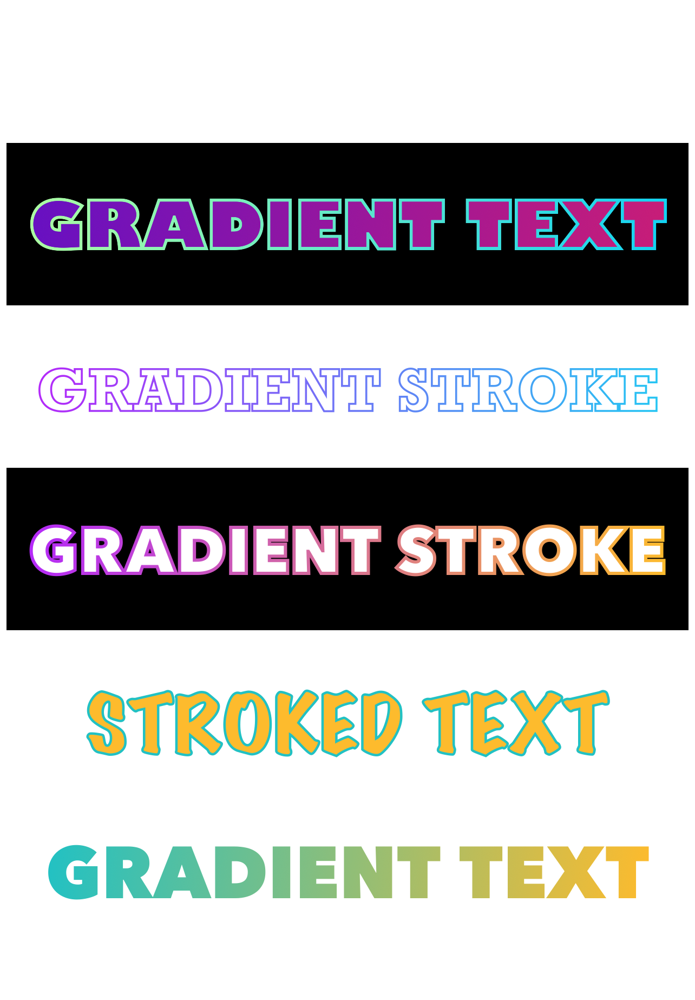

<h1 align="center" >
  react-native-gradient-texts
</h1>

<p align="center" >
  

  

  
</p>

## About

`react-native-gradient-texts` is React Native component for different Gradient styled Texts for iOS & Android.

---

## Installation

1. Install library

   from npm

   ```bash
   npm install react-native-gradient-texts
   ```

   from yarn

   ```bash
   yarn add react-native-gradient-texts
   ```

- Make sure that you have installed the [`react-native-svg`](https://github.com/react-native-svg/react-native-svg) libarary.

2. Link native code

   ```bash
   cd ios && pod install
   ```

---

## Example



<br>

1. Gradient Text with Gradient Border

```jsx
import React from "react";
import { StyleSheet, SafeAreaView } from "react-native";
import GradientText from "react-native-gradient-texts";

const App = () => {
  return (
    <SafeAreaView style={styles.container}>
      <GradientText
        text={"GRADIENT TEXT"}
        fontSize={40}
        isGradientFill
        isGradientStroke
        strokeWidth={2}
        style={{ backgroundColor: "black" }}
        width={420}
        locations={{ x: 210, y: 65 }}
        borderColors={["#adfda2", "#11d3f3"]}
        gradientColors={["#6710c2", "#c81d77"]}
        fontFamily={"Gill Sans"}
      />
    </SafeAreaView>
  );
};

export default App;

const styles = StyleSheet.create({
  container: {
    flex: 1,
    alignItems: "center",
    justifyContent: "center",
  },
});
```

2. Gradient Stroke Text

```jsx
<GradientText
    text={'GRADIENT STROKE'}
    fontSize={35}
    isGradientStroke
    width={420}
    locations={{x: 210, y: 65}}
    strokeWidth={1.2}
    fontFamily={'Rockwell'}
/>
<GradientText
    text={'GRADIENT STROKE'}
    fontSize={40}
    style={{backgroundColor: 'black'}}
    isGradientStroke
    strokeWidth={2}
    width={420}
    locations={{x: 210, y: 65}}
    borderColors={['#b429f9', '#fdbb2d']}
/>
```

3. Bordered Text

```jsx
<GradientText
  text={"STROKED TEXT"}
  fontSize={50}
  fillColor={"#fdbb2d"}
  width={420}
  locations={{ x: 210, y: 75 }}
  strokeWidth={1.5}
  strokeColor={"#22c1c3"}
  fontFamily={"Marker Felt"}
/>
```

4. Simple Gradient Text

```jsx
<GradientText
  text={"GRADIENT TEXT"}
  fontSize={45}
  width={420}
  locations={{ x: 210, y: 65 }}
  isGradientFill
  gradientColors={["#22c1c3", "#fdbb2d"]}
/>
```

---

## Props

| Props            | Params Type            | Default                | Description                            |
| ---------------- | ---------------------- | ---------------------- | -------------------------------------- |
| text (Required)  | String                 | ''                     | Text to be display                     |
| height           | Number                 | 100                    | SVG height                             |
| width            | Number                 | 300                    | SVG width                              |
| gradientColors   | [String, String]       | ['#810955', '#533483'] | Colors for text Gradient               |
| borderColors     | [String, String]       | ['#b429f9', '#26c5f3'] | Colors for text Border/Stroke          |
| locations        | {x: Number; y: Number} | {x: 150, y: 80}        | Distance on x, y axis                  |
| start            | {x: Number; y: Number} | {x: 0, y: 0}           | Start of the gradient on the x, y axis |
| end              | {x: Number; y: Number} | {x: 1, y: 1}           | End of the gradient on the x, y axis   |
| isGradientFill   | Boolean                | false                  | For gradient text                      |
| fillColor        | String                 | '#FFFFFF'              | For single colored text                |
| isGradientStroke | Boolean                | false                  | For gradient Text Border               |
| strokeColor      | String                 | '#000000'              | For simple text border                 |
| strokeWidth      | Number                 | 0                      | Text border Width                      |
| fontSize         | Number                 | 18                     | Customize font size                    |
| fontFamily       | String                 | 'Avenir Next'          | Customize font family                  |
| fontWeight       | String or Number       | 900                    | Customize font weight                  |
| style            | ViewStyle              | {}                     | Styling for container view             |

---

## Author

<h4>Drashti Sabhaya</h4>

<p align="left">
  <a href="https://www.linkedin.com/in/drashti-sabhaya/" target="_blank"></a>
<p>

---

## License

This project is under the MIT license. See the [LICENSE](./LICENSE) to learn more.
<br>
[Contact!](https://www.linkedin.com/in/drashti-sabhaya/)
